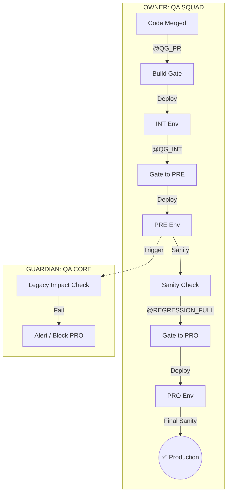
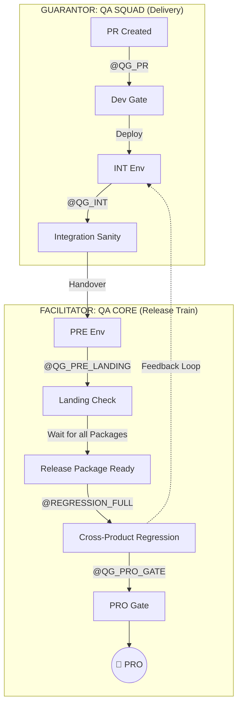

# QA Automation Strategy

## Purpose
This page defines the <strong>Global Quality and Automation Strategy</strong> for Iberia. It serves as the formalization of our <strong>Quality as a Shared Responsibility culture</strong>, evolving from a reactive "test-at-the-end" model to a proactive, synchronous engineering approach.

## Audience

<ul>
  <li><strong>Software Engineer:</strong> Responsible for the technical implementation of the testing base (Unit/Integration) and ensuring code solidity.</li>
  <li><strong>Technical Lead:</strong> Guardian of architectural alignment and mocking strategies.</li>
  <li><strong>QA Engineer:</strong> Lead strategist for functional verification, RBT application, and E2E orchestration.</li>
  <li><strong>QA Champion:</strong> Auditor of quality gates and enforcer of the "Zero-Lag" and "Zero-Flakiness" policies.</li>
</ul>

## Overview

High-level strategic framework for Iberia's quality ecosystem. It bridges the gap between business requirements and technical execution through a risk-focused lens.

* For tactical execution, see [QA Squad Lifecycle](../../04-how-we-work/qa/00-squad-lifecycle-overview.md).
* For tool-specific standards, see [Backend Automation (Karate)](../../03-tech-stack/backend/qa-backend-automation-karate.md) and [Frontend Automation (WebDriverIO)](../../03-tech-stack/frontend/qa-frontend-automation-webdriverio.md).

### Principles

<ul>
  <li><strong>Business-Defined Quality:</strong> Quality is defined by Business and the PO in <strong>[PHASE 0/1]</strong> via critical flows.</li>
  <li><strong>WHAT vs. HOW:</strong> QA defines the functional "WHAT"; Development defines the technical "HOW."</li>
  <li><strong>Synchronous Automation:</strong> Automated tests are part of development and the Definition of Done (DoD); no code without tests.</li>
  <li><strong>Product Focus:</strong> Each squad validates its vertical product in isolation before integration.</li>
  <li><strong>D.R.Y. Testing:</strong> Avoid redundant testing across layers; use RBT to find the most efficient level for each check.</li>
</ul>

### When to Use This Guidance

Use this strategy when planning new features, defining sprint test plans, or establishing Quality Gates in the CI/CD pipeline. It applies to all squads following the Iberia Engineering Model.

## Risk-Based Testing (RBT) Matrix

Used during refinement to invest automation efforts where business risk is highest.

| Business Impact / Probability of Failure | High (Complex, new functionality) | Medium (Modifications on stable code) | Low (Very stable and isolated functionality) |
| :--- | :--- | :--- | :--- |
| **P1 - CRITICAL** (Stops operations) e.g., Payment, Login, Issuance | **P1 - CRITICAL** | **P1 - CRITICAL** | **P2 - HIGH** |
| **P2 - HIGH** (Severe disruption) e.g., Ancillaries, Search failure | **P1 - CRITICAL** | **P2 - HIGH** | **P3 - MEDIUM** |
| **P3 - MEDIUM** (Inconvenience with workaround) e.g., Special meals | **P2 - HIGH** | **P3 - MEDIUM** | **P4 - LOW** |
| **P4 - LOW** (Cosmetic impact) e.g., Broken static links | **P3 - MEDIUM** | **P4 - LOW** | **P4 - LOW** |

<ul>
  <li><strong>P1 - CRITICAL:</strong> Mandatory automation in the <strong>Critical Suite.</strong></li>
  <li><strong>P2 - HIGH:</strong> Automation highly recommended for the <strong>Regression Suite.</strong></li>
  <li><strong>P3 - MEDIUM:</strong> Automated if time and resources permit.</li>
  <li><strong>P4 - LOW:</strong> Generally not automated at the E2E level.</li>
</ul>

## Automation Suites Comparative Table (Detailed Operational Model)

| Characteristic | 1. PR Gate (Critical) | 2. INT Validation (Product Regression) | 3. INT NIGHTLY (Sprint Health) 🌑 | 4. PRE Stability (Landing) | 5. PRE NIGHTLY (Stabilization) 🌑 | 6. FULL RELEASE REGRESSION (Go/No-Go) 🚀 | 7. PRO Pre-Flight Gate |
| :--- | :--- | :--- | :--- | :--- | :--- | :--- | :--- |
| **Suite ID** | `E2E_PR_CHECK` | `E2E_INT_PRODUCT` | `E2E_INT_NIGHTLY` | `E2E_PRE_LANDING` | `E2E_PRE_NIGHTLY` | `E2E_PRE_FULL` | `E2E_PRO_GATE` |
| **Tag** | `@QG_PR` | `@QG_INT` | `@INT_EXTENDED` | `@QG_PRE_LANDING` | `@PRE_STABILITY` | `@REGRESSION_FULL` | `@QG_PRO_GATE` |
| **Execution** | PIPELINE (CI) | PIPELINE (CD) | **UNATTENDED** | PIPELINE (CD) | **UNATTENDED** | **ON-DEMAND** | PIPELINE (Release) |
| **Frequency** | Per Pull Request. | Per Deploy to INT. | Nightly (Daily). | Per Deploy to PRE. | Periodic (e.g., every 48h). | Once per Release Cycle. | Per Deploy to PRO. |
| **Time Limit** | **< 15 min** | **< 45 min** | **< 4 Hours** | **< 30 min** | **< 4 Hours** | **< 2 Hours** | **< 30 min** |
| **Owner** | QA SQUAD | QA SQUAD | QA SQUAD | QA CORE | QA CORE | QA CORE | QA CORE |
| **Purpose** | Fire detector. Blocks bad code early. | Guarantee Squad's product quality. | **Deep Health Check.** Validate Edge Cases & Sprint robustness. | Guarantee deployment didn't break the Env. | **Stabilization.** Detect integration drifts early. Complementary to Release. | **Certification.** Final Go/No-Go decision for the Release. | Final safety check. |
| **Scope** | P1 (Happy Path). Toggle: **OFF**. | **Path A:** Deep Mock. **Path B:** Sanity. Toggle: **Dual**. | **FULL SCOPE (P1-P3).** Retries, Heavy Data. Toggle: **Combinatorial**. | Critical Env Check. **NO MOCKS**. | **INTEGRATION STRESS.** Complex flows. Toggle: **Combinatorial**. | **RELEASE SCOPE.** Cross-Product Validation. Toggle: **RELEASE CONFIG**. | Artifact Check. Toggle: PRO Config. |
| **Failure Result** | Blocks `Merge`. | Blocks `PRE`. | **Alert to Squad.** (Morning Fix). | Rejects Package. | **Alert to Core/Squads.** (Fix before Release). | **STOP RELEASE.** (Block PRO). | Blocks `PRO`. |

## Naming & Tagging Standards

To ensure "Zero-Touch" execution, all automated tests must be tagged correctly in the code.

### The Tags Strategy
* **`@QG_PR`**: Critical Smoke tests (P1). Must be ultra-fast (<15m) to unblock developers.
* **`@QG_INT`**: Standard regression for the Pipeline (P1/P2). Validates the specific feature.
* **`@INT_EXTENDED`**: **Nightly INT.** Tests that are too slow/complex for the pipeline (P3, Edge Cases, Heavy Data).
* **`@QG_PRE_LANDING`**: Minimum set to verify environment stability when a new package arrives in PRE.
* **`@PRE_STABILITY`**: **Periodic PRE.** Unattended suite running every ~48h to detect integration drifts early.
* **`@REGRESSION_FULL`**: **The Release Exam.** The master suite executed only when the full Release Package is assembled. Its passing is mandatory for the Go/No-Go decision.
* **`@QG_PRO_GATE`**: **Pre-Flight Check.** A quick, read-only smoke test that validates the final artifact integrity and configuration just before the deployment to Production.

## The Journey of Quality: From Idea to Production

We acknowledge two distinct delivery paths depending on the architectural nature of the product.

### Path A: Single-Product Journey (Autonomy & Speed)

Designed for features affecting only one product. Each story reaches production independently and fast.

<ul>
  <li><strong>Owner: QA Squad</strong> (From Dev to PRO).</li>
</ul>

#### Execution Model:

#### Detailed Controls (Single-Product)

<ol>
  <li><strong>Critical Suite (Build Gate):</strong> Ultra-fast E2E for P1s. Acts as a "fire detector" to see if code broke existing core functions. Mostly runs <strong>without mocks</strong> for internal logic but mocks 3rd party providers. <strong>Toggle: OFF</strong>.</li>
  <li><strong>Product Regression - Critical (Gate to PRE):</strong> Deep functional inspection. <strong>Dual Validation:</strong> (A) Toggle OFF for regression, (B) Toggle ON for the new feature.</li>
  <li><strong>Sanity Check (PRE):</strong> Confirm deployment was successful and the app is "alive."</li>
  <li><strong>Product Regression - Critical (Gate to PRO):</strong> Re-runs the gate suite to catch environmental issues (config, networks, secrets) in PRE that were missing in INT.</li>
  <li><strong>Final Sanity Check (PRO):</strong> Final verification in the real environment. Triggers critical alerts if failed.</li>
</ol>

### Path B: Multi-Product / Legacy Journey (High Safety)

For the Monolith or tightly coupled systems. Quality is a relay race.

<ul>
  <li><strong>Owner Phase 1: QA Squad</strong> (From Dev to INT).</li>
  <li><strong>Owner Phase 2: QA Core</strong> (From PRE to PROD).</li>
  <li>Supervisor and guarantor of quality from start to finish <strong>Owner: QA squad</strong> (From DEV to PROD).</li>
</ul>

#### Execution Model:

#### Detailed Controls (Multi-Product)

<ol>
  <li><strong>INT Validation (Squad):</strong> Focus on "My Feature" + "Basic Integration". <strong>Toggle Validation:</strong> Ensure the Feature Toggle logic works correctly (ON/OFF) before leaving INT.</li>
  <li><strong>PRE Validation (Core executes, Squad fixes):</strong> The "Big Bang" validation. <strong>QA Core</strong> triggers the suite, but if the "Check-in" module fails, the Check-in Squad is summoned to fix it.</li>
  <li><strong>Governance:</strong> The Squad ensures their feature is "Release Ready" (Toggle ON) or "Dark" (Toggle OFF) before the train departs.</li>
</ol>

### Ownership Matrix (Summary)

| Stage | Path A (Autonomous) | Path B (Legacy/Multi) |
| :--- | :--- | :--- |
| **1. PR Gate** | **QA Squad** | **QA Squad** |
| **2. INT Pipeline** | **QA Squad** | **QA Squad** |
| **3. INT Nightly** | **QA Squad** | **QA Squad** |
| **4. PRE Landing** | **QA Squad** | **QA Core** (Execution) / **QA Squad** (Fix) |
| **5. PRE Stabilization** | **QA Squad** | **QA Core** (Execution) / **QA Squad** (Result Owner) |
| **6. Full Release** | **QA Squad** | **QA Core** (Execution) / **QA Squad** (Result Owner) |
| **7. PRO Deployment** | **QA Squad** | **QA Core** (Release Manager) |

## Production Deployment Strategies

The way we release code into production is as important as testing. The product team, in collaboration with the relevant IBERIA team (e.g. SRE, Release Management), will define the strategy to be followed. The most common ones are:

<ul>
  <li><strong>Blue/Green Deployment:</strong> Two identical environments ("Blue" active, "Green" inactive). Deployment happens in "Green." Once Sanity Checks pass, traffic is switched. "Blue" remains as an instant backup for rollback.</li>
  <li><strong>Canary Release:</strong> Gradual rollout starting at 5% of users. Monitoring focused on this "canary" group. If metrics remain healthy, the release expands to 100%. Ideal for high-impact changes.</li>
</ul>

## Related Resources

* [QA Squad Lifecycle](../../04-how-we-work/qa-squad-lifecycle.md)
* [Data Management](./01-test-data-management-strategy.md)